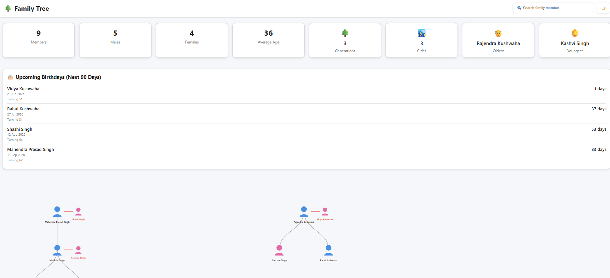

# 🌳 Family Tree Generator

Create and publish an interactive family tree using simple CSV files and GitHub Pages.

Perfect for preserving family history, documenting ancestry, maintaining family records, and sharing family relationships publicly with relatives around the world.

---

## ✨ Features

✅ Interactive family tree

✅ Parent → Child relationships

✅ Spouse relationships

✅ Family statistics dashboard

✅ Upcoming birthdays

✅ Search family members

✅ Hover tooltips with personal details

✅ Automatic age calculation

✅ Gender-based default profile icons

✅ Data validation before deployment

✅ GitHub Pages hosting

✅ Fully static website (no database required)

---

## 📸 Screenshot

### Family Tree UI



---

## 🚀 Live Demo

After deployment, your site will be available at:

```text
https://<github-username>.github.io/<repository-name>/
```

Example:

```text
https://mohitmsingh.github.io/family-tree/
```

---

# 📂 Repository Structure

```text
family-tree/
│
├── data/
│   ├── people.csv
│   └── families.csv
│
├── generated/
│   └── family.json
│
├── photos/
│   ├── male.svg
│   ├── female.svg
│   ├── family-tree-ui.png
│   └── <person-photos>
│
├── scripts/
│   ├── validate_family.py
│   └── generate_tree.py
│
├── web/
│   ├── index.html
│   ├── app.js
│   ├── tree.js
│   ├── search.js
│   ├── tooltip.js
│   ├── stats.js
│   └── style.css
│
└── .github/
    └── workflows/
        └── deploy-pages.yml
```

---

# 👨‍👩‍👧‍👦 Adding Family Members

Edit:

```text
data/people.csv
```

Example:

```csv
id,name,dob,gender,birth_place,current_city,photo
p001,Mahendra Prasad Singh,1964-09-11,male,Nagpur,Nagpur,
p002,Shashi Singh,1972-08-12,female,Gorakhpur,Nagpur,
p003,Mohit M Singh,1990-10-06,male,Gorakhpur,Nagpur,mohit.jpg
```

### Columns

| Column       | Description                |
| ------------ | -------------------------- |
| id           | Unique person identifier   |
| name         | Full name                  |
| dob          | Date of birth (YYYY-MM-DD) |
| gender       | male / female              |
| birth_place  | Birth location             |
| current_city | Current city               |
| photo        | Image filename             |

---

# 👪 Defining Families

Edit:

```text
data/families.csv
```

Example:

```csv
parent1,parent2,children
p001,p002,p003
p003,p004,p005|p006
p007,p008,p004
```

### Explanation

```text
Mahendra + Shashi
│
└── Mohit

Mohit + Kanchan
│
├── Satvik
└── Kashvi
```

Multiple children are separated using:

```text
|
```

Example:

```csv
p003,p004,p005|p006|p007
```

---

# 🖼 Adding Photos

Store photos inside:

```text
photos/
```

Example:

```text
photos/
├── mohit.jpg
├── satvik.jpg
├── kanchan.jpg
```

Reference them from:

```csv
photo
mohit.jpg
satvik.jpg
```

If no photo is provided:

* 👨 Male icon is used
* 👩 Female icon is used

automatically.

---

# 🎂 Upcoming Birthdays

The site automatically displays birthdays occurring within the next 90 days.

Information shown:

* Name
* Birthday date
* Days remaining
* Age turning

Generated automatically during build.

---

# 📊 Family Statistics

The dashboard automatically calculates:

* Total members
* Male count
* Female count
* Average age
* Oldest member
* Youngest member
* Total generations
* Cities represented
* Upcoming birthdays

No manual updates required.

---

# 🔍 Search

Search by:

* First name
* Last name
* Partial name

Example:

```text
Mohit
```

```text
Singh
```

```text
Mahendra
```

Results instantly center on matching family members.

---

# 🛡 Validation

Before generating the tree:

```bash
python scripts/validate_family.py
```

Checks include:

* Duplicate IDs
* Missing columns
* Invalid gender values
* Invalid DOB format
* Missing people references
* Unknown parents
* Unknown children
* Self-parent relationships

Example:

```text
Validation successful (8 people, 3 families)
```

---

# ⚙ Generate Tree Data

Run:

```bash
python scripts/generate_tree.py
```

Output:

```text
generated/family.json
```

Example:

```text
Successfully generated:
generated/family.json

Members: 8
Generations: 3
Cities: 2
```

---

# 💻 Local Development

Start a local web server:

```bash
python -m http.server 8000
```

Open:

```text
http://localhost:8000
```

---

# 🌐 GitHub Pages Deployment

Push changes:

```bash
git add .
git commit -m "Update family data"
git push
```

GitHub Actions will:

1. Validate CSV files
2. Generate family.json
3. Build website
4. Deploy to GitHub Pages

---

# ⏰ Scheduled Updates

The workflow automatically runs every Monday.

This ensures:

* Ages remain accurate
* Upcoming birthdays stay current
* Statistics remain updated

No manual intervention required.

---

# 🤝 Contributing

Contributions are welcome.

Ideas:

* Ancestor mode
* Descendant mode
* Multiple tree layouts
* Family timelines
* Photo galleries
* Export to PDF
* GEDCOM import/export

---

# 📜 License

MIT License

Feel free to fork, modify, and use for your own family history projects.

---

Made with ❤️ for preserving family history across generations.
